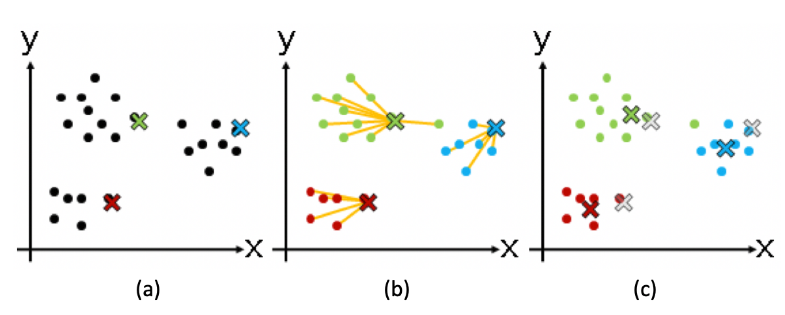

# 文本聚类

## k-means

尽可能大的放大同组的相似度，尽量缩小异群之间的相似度。



分析步骤：

1. 从 N 个数据对象中随机选取 k 个对象作为质心，质心定义为每个群成员对象的平均值。
2. 对剩余对象，测试其与质心的距离或者是相似度。并把他归纳倒最近的质心群中。
3. 根据每个集群的向量，更新质点的位置。
4. 迭代上面的第 2 步和第 3 步，直至新的质心与原质心相等或相差之值小于指定阈值，算法结束。

```python
def customKmeans(vec_array, n_clusters=3, epochs=500):
    '''
    @description: 手动实现kmeans，以向量间的夹角余弦作为相似度
                 根据上述tf-idf得到的7条文本向量vec_array，进行聚类算法
    @param {type} vec_array- 向量组, n_clusters-聚类数目, epochs- 训练次数
    @return: cluster_labels- 分类标签
    '''

    # 初始化质心的位置
    cluster_centers = []
    cluster_centers_indx = []
    while (len(cluster_centers_indx) < n_clusters):
        indx = random.randint(0, len(vec_array)-1)
        if indx not in cluster_centers_indx:
            cluster_centers_indx.append(indx)
            cluster_centers.append(vec_array[indx])

    # 初始化向量类别
    cluster_centers = np.array(cluster_centers)
    cluster_labels = [0] * len(vec_array)
    epoch = 0
    while(epoch < epochs):
        # 计算每个向量与质心的相似性，并将其归纳到最近的质心集群中
        for i in range(0, len(vec_array)):
            # max_similarity = computeCosine(vec_array[i], cluster_centers[0])
            min_similarity = computeEuDistance(
                vec_array[i], cluster_centers[0])
            cluster_labels[i] = 0
            for j in range(1, n_clusters):
                temp = computeEuDistance(vec_array[i], cluster_centers[j])
                if (temp < min_similarity):
                    min_similarity = temp
                    cluster_labels[i] = j

        # 更新质心位置
        cluster_centers_old = np.copy(cluster_centers)
        for i in range(0, n_clusters):
            # 找到集群对应原向量的下标
            indxs = [indx for indx, cluster in enumerate(
                cluster_labels) if cluster == i]
            # 根据集群向量的平均值更新质点位置
            cluster_centers[i] = np.average(
                [vec_array[indx] for indx in indxs], axis=0)

        # 当满足迭代次数或质心位置几乎不变时退出算法
        diff = cluster_centers - cluster_centers_old
        if (max(np.linalg.norm(x) for x in diff) < 1e-10):
            break
        epoch += 1
    return cluster_labels


def computeCosine(vec1, vec2):
    # 计算向量间的余弦值
    vecCosine = np.dot(vec1, vec2) / \
        (np.linalg.norm(vec1) * np.linalg.norm(vec2))
    return vecCosine


def computeEuDistance(vec1, vec2):
    # 计算向量间的欧式距离
    dist = [vec1[i] - vec2[i] for i in range(len(vec1))]
    dist = np.linalg.norm(dist)
    return dist

```

- 在文本分类中需要提前将文本转化成向量，结果如下。仍有优化的地方。[代码在这里](kmeans_text.py)

1: ['I like great basketball game', 'I really really like basketball', 'Do you like RPG game?'], 

2: ['This video game is the best action game I have ever played', 'You can try this FPS game'], 

0: ['How about this movie? Is the plot great?', 'The movie is really great, so great! I enjoy the plot']

- 在数字向量的分类上，聚类数目为2。[代码在这里](kmeans.py)


