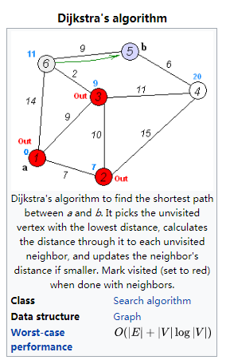
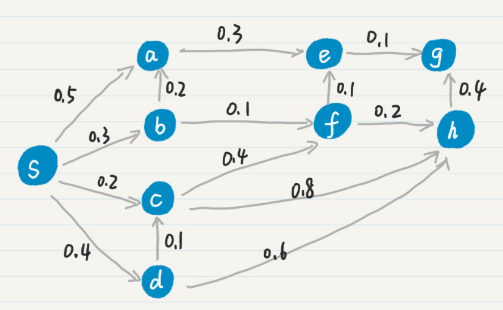
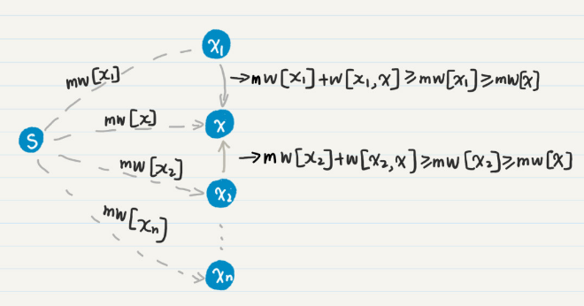
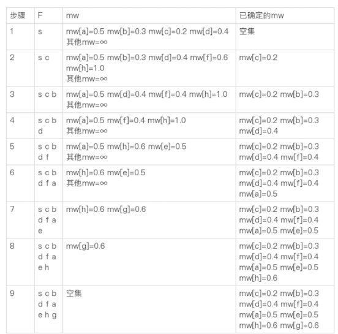

# 图

广度优先搜索算法可以判断路的通路，图需要在上面加入权重概念。

A-B三条路，但是用时（权重）不一样。


## Dijkstra算法-单源最短路径算法

思想：指定某一节点，求到指定结点的最短路径。对于某个结点，如果发现了最优的通路，则在后续的步骤无需考虑该结点。--类似于动态规划。

- source：起点，s

- weight：任意边的权重，二维数组，w[m,n]：m-n有向边的权重。如存在多个权重，取最小值。不能直接到达的边，权重为无穷大。

- min_weight：source到任意结点的最小权重，一维数组。mw[s] = 0;

- finish：已经找到最小权重的结点之集合。一旦结点放入集合F，这个结点在将不参加未来的计算。

### 步骤

1. 查找最小的mw，并将对应结点加入Finish。

2. 更新权重
    

  

### 示例



其中mw[x]为最小值。



推导过程：

 


### 算法实现

[PseudoCode](https://en.wikipedia.org/wiki/Dijkstra%27s_algorithm)

```pseudocode
function Dijkstra(Graph, source):
 
   create vertex set Q

   for each vertex v in Graph:           // Initialization
     dist[v] ← INFINITY                  // Unknown distance from source to v
     prev[v] ← UNDEFINED                 // Previous node in optimal path from source
     add v to Q                          // All nodes initially in Q (unvisited nodes)
 
   dist[source] ← 0                      // Distance from source to source
      
   while Q is not empty:
     u ← vertex in Q with min dist[u]    // Node with the least distance
                                         // will be selected first
     remove u from Q 
         
     for each neighbor v of u:           // where v is still in Q.
       alt ← dist[u] + length(u, v)
       if alt < dist[v]:                 // A shorter path to v has been found
         dist[v] ← alt 
         prev[v] ← u 

    return dist[], prev[]
```

[C++ 实现](dijkstra.cpp)

1. 先创建带权值的单向图

   邻接表：

   

2. 再使用Dijkstra搜索图

