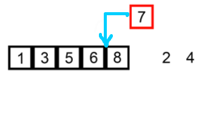

# Sort Algorithm

## 稳定性

稳定排序：相等的元素次序保持不变。

不稳定排序： 相等的元素次序发生变化。

## 简单排序&冒泡排序 

原理：每次向前比较选出最小的数据（或向后选出最大的数据）,排出一个气泡。

时间复杂度：O(n^2)

空间复杂度：O(1)

```c++
// 向前比较选出最小的数据
void easySort(vector<int>& nums) {
      int len = nums.size();
      int temp;
      for (int i = 0; i < len-1; i++) {
        for (int j = i+1; j < len; j++) {
          if (nums[j] < nums[i]) {
            temp = nums[i];
            nums[i] = nums[j];
            nums[j] = temp;
          }
        }
      }
    }
}
// 向后比较选出最大的数据
void bubbleSort(vector<int>& nums) {
      int len = nums.size();
      int temp;
      for (int i = 0; i < len-1; i++) {
        for (int j = 0; j < len-1-i; j++) {
          if (nums[j] > nums[j+1]) {
            swap(nums[j], nums[j+1]);
          }
        }
      }
    }
}
```

## 插入排序



原理：对于未排序数据，在已排序序列中从后向前扫描，找到相应的位置并插入，其它数据后移。

最坏时间复杂度：O(n^2)

最坏空间复杂度：总共O(n)，需要辅助空间O(1)

```c++
void insertSort(vector<int>& nums) {
    int temp = 0; // save current data 
    for (int i = 1; i < nums.size(); i++) { // begins at nums[1]
        temp = nums[i];
        for (int j = i-1; j >= 0; j--) { 
            // compare from back to front
            if (temp < nums[j]) {
                // move back array
                nums[j+1] = nums[j];
            	nums[j] = temp; // new position
            } else {
                break;
            }
        }
    }
}
```

## 归并排序

原理：建立在归并操作上的一种有效的排序算法。

步骤：

1. 把长度为n的array分成两半。
2. 左右两边分别进行排序。
3. 把左右两边merge合并。

时间复杂度：O(nlogn)

空间复杂度：O(n)

分类：

1. 递归法（Top-down）
  - 申请空间，使其大小为两个已经排序序列之和，该空间用来存放合并后的序列。
  - 设定两个指针，最初位置分别为两个已经排序序列的起始位置。
  - 比较两个指针所指向的元素，选择相对小的元素放入到合并空间，并移动指针到下一位置。
  - 重复步骤3直到某一指针到达序列尾。
  - 将另一序列剩下的所有元素直接复制到合并序列尾。
2. 迭代法（Bottom-up）（假设序列共有 n个元素）：
  - 将序列每相邻两个数字进行归并操作，形成 ceil(n/2)个序列，排序后每个序列包含两/一个元素。
  - 若此时序列数不是1个则将上述序列再次归并，形成 ceil(n/4)个序列，每个序列包含四/三个元素。
  - 重复步骤2，直到所有元素排序完毕，即序列数为1

```C++
// 递归法
#include <limits>
#include <vector>

using namespace std;

void merge(vector<int>& nums, int left, int mid, int right) {
  // Allocate and assign data to sub left and right array
  // [left, mid]
  vector<int> leftSub(nums.begin() + left, nums.begin() + mid + 1);  
  //[mid+1, right]
  vector<int> rightSub(nums.begin() + mid + 1, nums.begin() + right + 1);  
  // keep comparasion successfully when one sub is totally lower than other,
  // such as [1,2]vs[3,4]. You need to add max<int> to make sure pointers within
  // control, like [1,2,max] vs [3,4, max], then you can get [1,2,3,4]
  leftSub.insert(leftSub.end(), numeric_limits<int>::max());
  rightSub.insert(rightSub.end(), numeric_limits<int>::max());
  // define pointers
  int leftPtr = 0;
  int rightPtr = 0;
  // merger array
  for (int i = left; i <= right; i++) {
    if (leftSub[leftPtr] < rightSub[rightPtr]) {
      nums[i] = leftSub[leftPtr++];
    } else {
      nums[i] = rightSub[rightPtr++];
    }
  }
}
// main function
void mergeSort(vector<int>& nums, int left, int right) {
  if (left >= right) {
    return;  // exit function
  } else {
    int mid = (left + right) >> 1;
    mergeSort(nums, left, mid);       // merge sort left
    mergeSort(nums, mid + 1, right);  // merge sort right
    merge(nums, left, mid, right);    // merge left and right
  }
}
```

归并排序-递归法2
**FIXME：无法编译正常结果，暂时未找到原因。**
```c++
#include <iostream>
#include <limits>
#include <vector>

using namespace std;
class Solution {
  // one-paid allocate temp memory
 public:
  void merge(vector<int>& nums, int left, int mid, int right,
             vector<int>& temp) {
    // define pointers
    int leftPtr = 0;
    int rightPtr = mid + 1;
    // comparasion
    int t = 0;
    while (leftPtr <= mid && rightPtr <= right) {
      if (nums[leftPtr] < nums[rightPtr]) {
        temp[t++] = nums[leftPtr++];
      } else if (nums[leftPtr] > nums[rightPtr]) {
        temp[t++] = nums[rightPtr++];
      }
    }
    // merge data to temp
    while (leftPtr <= mid) {
      temp[t++] = nums[leftPtr++];
    }
    while (rightPtr <= right) {
      temp[t++] = nums[rightPtr++];
    }
    t = 0;
    // merge data to original array
    while (left <= right) {
      nums[left++] = temp[t++];
    }
  }

 public:
  void mergeSort(vector<int>& nums, int left, int right, vector<int>& temp) {
    if (left < right) {
      int mid = (left + right) >> 1;
      mergeSort(nums, left, mid, temp);       // merge sort left
      mergeSort(nums, mid + 1, right, temp);  // merge sort right
      merge(nums, left, mid, right, temp);    // merge left and right
    }
  }
};

int main(void) {
  Solution test;
  int a[8] = {2,4,5,1,9,6,7,0};
  vector<int> nums(a, a+8);
  // Allocate temp arrar
  vector<int> temp(nums.size(), 0);
  test.mergeSort(nums, 0, 7, temp);

  for (int i = 0; i < nums.size(); i++) {
    cout << nums[i] << endl;
  }
}
```

```c++
// 迭代法
template<typename T> // 整數或浮點數皆可使用,若要使用物件(class)時必須設定"小於"(<)的運算子功能
void mergeSort(T arr[], int len) {
    T *a = arr;
    T *b = new T[len];
    for (int seg = 1; seg < len; seg += seg) {
        for (int start = 0; start < len; start += seg + seg) {
            int low = start, mid = min(start + seg, len), high = min(start + seg + seg, len);
            int k = low;
            int start1 = low, end1 = mid;
            int start2 = mid, end2 = high;
            while (start1 < end1 && start2 < end2)
                b[k++] = a[start1] < a[start2] ? a[start1++] : a[start2++];
            while (start1 < end1)
                b[k++] = a[start1++];
            while (start2 < end2)
                b[k++] = a[start2++];
        }
        T *temp = a;
        a = b;
        b = temp;
    }
    if (a != arr) {
        for (int i = 0; i < len; i++)
            b[i] = a[i];
        b = a;
    }
    delete[] b;
}
```

