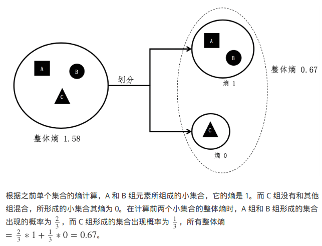

# 信息熵 Entropy

如何设计问题判断，来将武侠人物划分出来？

## 定义

信息熵，简称熵，用来刻画集合的纯净度的一个指标。根据化学中的原理，熵可以用来表征混乱度，越混乱（分类越多），熵越大。
$$
Entropy(P) = - \sum_{i=1}^n{p_i * log_2(pi)}
$$
n 为分组数量，pi为第i个分组在集合中出现的概率。

### 小集合的熵

对于小集合而言，整体的熵为各个小集合熵的加权平均值。
$$
\sum_{v\in value(T)} \frac{P(v)}{P}*Entropy(P(v))
$$
P(v)是某个小集合，Entropy(P(v))是它的熵。P(v)/P：表示小集合在大集合中的概率。

### 信息增益 Information Gain

从上图可以发现，当集合拆分后，熵减小1.58到0.67，这个过程是信息增益。
$$
Gain(P,T) = Entropy(P) - \sum_{v\in value(T)} \frac{P(v)}{P}*Entropy(P(v))
$$
T对应为某一特征，当信息增益越大，则特征拆分效果越明显。

